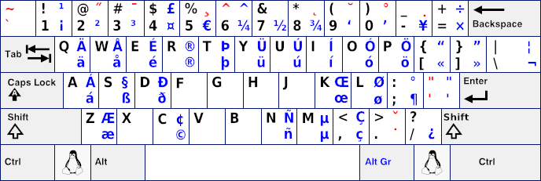
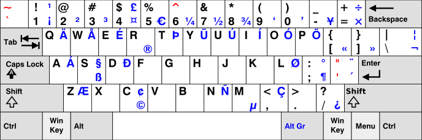
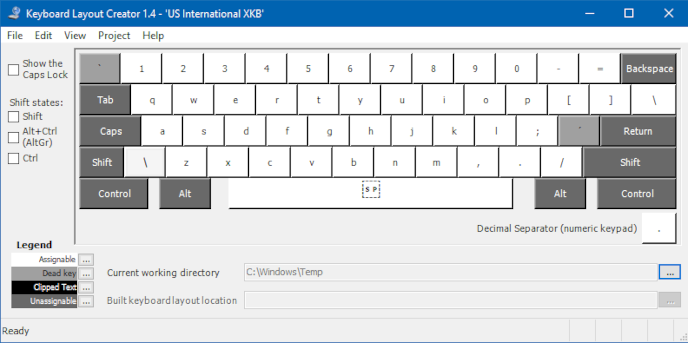
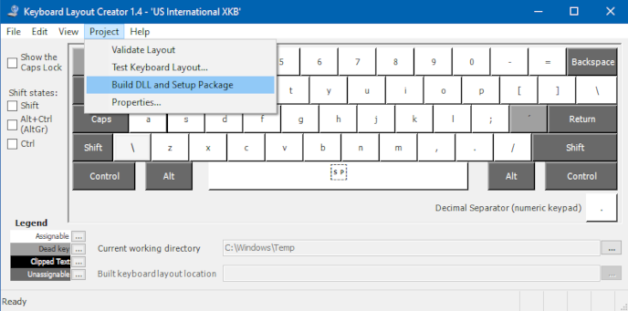
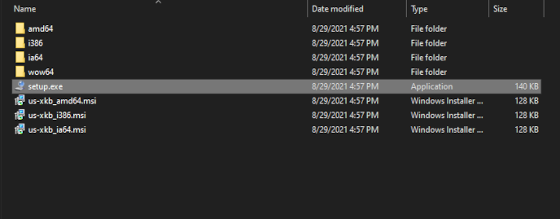

# US International XKB

This aims to be a fully compatible implementation of the XKB US International layout (shown below) for Windows.

In comparison, this is the US International keyboard layout that ships with Windows.

# Installation

Clone this repo and open [us-xkb.klc](us-xkb.klc) in [Microsoft Keyboard Layout Creator (MSKLC)](https://www.microsoft.com/en-us/download/details.aspx?id=102134). It should look something like this.

Build DLL and Setup Package.

Execute the setup file.

You should be able to change your keyboard layout to US International XKB.
Remember to log out and in again, in order for the changes to take effect.

# Contributing

If you find any errors or just want to add missing keycodes feel free to [submit a PR](https://github.com/jaycefayne/US-International-XKB/pulls).
